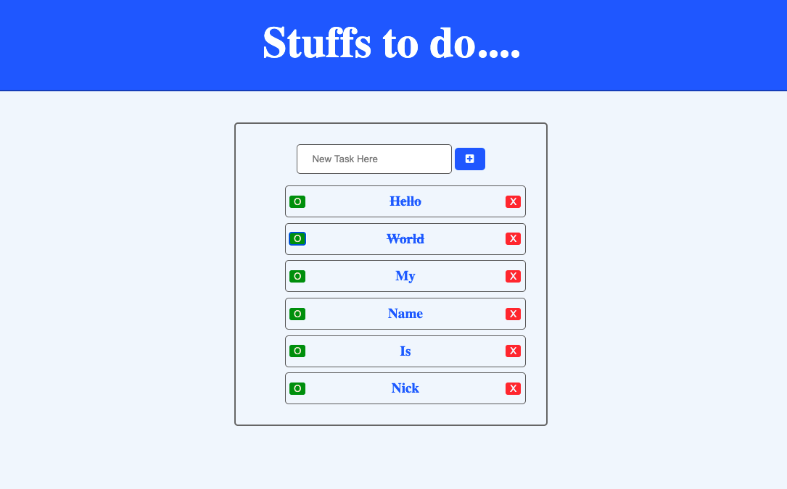

# ToDo Application

### This is a simple Todo list application that uses HTML CSS anf Vanilla Javavscript
 
#### You can use the app [here](https://beethoven3579.github.io/My-To-Do-App/) 

## Project Summary

## About Me

Nick Paolino -- Full-time programming student -- [LinkedIn](https://www.linkedin.com/in/nick-paolino-00469291/)
